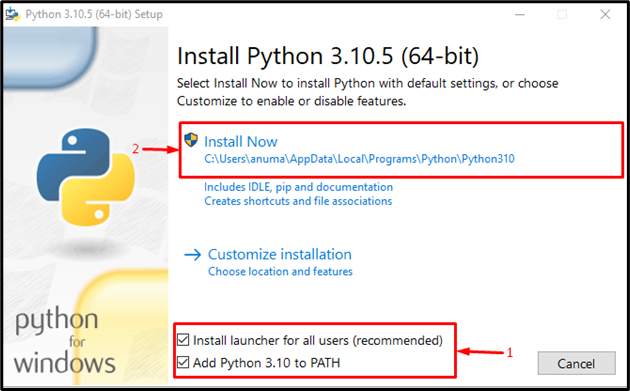
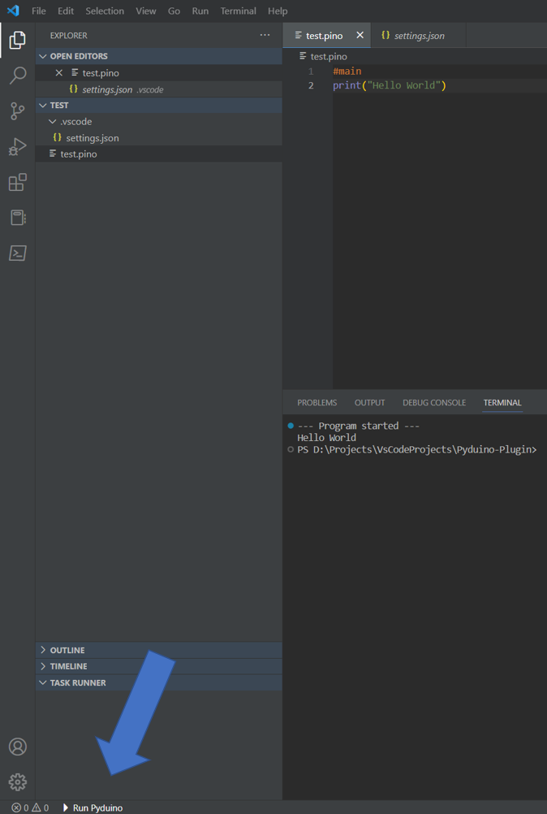

# Pyduino

Pyduino is a new programming language that allows you to write code for the Arduino Microcontroller in a Python-like syntax.
It is designed to be easy to learn and use, and is a great way to get started with programming. The core features of Pyduino are:
- Easy to learn, Python-like syntax
- The same syntax runs on both the Arduino and the PC
- PC and Arduino can be connected via the serial port
- The PC can access Arduino's pins and sensors
- The is able to print output to the PC console
- They can run independently or together
- VS Code Extension to develop and run Pyduino programs

The language works by transpiling the Pyduino code to C++ and the compiling it to run on the Arduino and on the PC.	
To exchange data or call functions between the PC and the Arduino, the serial port is used. The PC uses a separate listener
thread to listen for data from the Arduino. The Arduino doesn't support multithreading, so it checks after every command	
if there is data to be read from the serial port. If there is, it reads it and executes the command.

## Getting Started


To get started, you need to install VS Code. You can download it from [here](https://code.visualstudio.com/Download).

You also need a Python interpreter. You can download it from [here](https://www.python.org/downloads/release/python-3102/) (at the bottom of the page).
Make sure to add Python to your PATH by checking the box in the installer.




Currently, 7zip is required to extract the C++ Compiler. You can download it from [here](https://www.7-zip.org/download.html).

To install the Pyduino extension, open VS Code and press Ctrl+Shift+X to open the extensions menu. Search for Pyduino and install it.

Then open a .pino file and the Extension will provide Syntax Highlighting and Error Checking.

To run the code, press the run Button in the bottom left corner. The code will be transpiled to C++ and compiled. If there are no errors, the code will be executed.



## Features
### Variables
Variables are declared with the datatype and name, and can be assigned a value.
There is no semicolon at the end of a line.
```c 
int x = 5
float y = 3.14
```
Arrays are declared with the datatype, name and an intializer list.
```c
int[] x = [1, 2, 3]
int y[] = [x[0], 23, 42]
```

### Loops
There are two types of loops: for loops and while loops. They work the same as in Python.
```python
# for loop
for i in range(10):
    print(i)

for i in y:
    print(i)
   
# while loop
int x = 0
while x < 10:
    print(x)
    x += 1
```
You can also use the `break` and `continue` keywords to break out of a loop or skip the current iteration. 

### Input and Output 
The print function prints to the PC's console. If it is called on the Arduino and the Arduino is connected to the PC, it will print to the PC's console as well.
```python
print("Hello World")
print("x = ", x)
```

The analogRead reads the value of the analog pin on the Arduino and returns it as an int from 0 to 1023. The digitalRead reads the value of the digital pin and returns it as a boolean.
```python
analogRead(0)
digitalRead(1)
```

The analogWrite writes an analog value to the pin. The value must be an int from 0 to 255. The digitalWrite writes a digital value to the pin.
```python
analogWrite(11,255)
digitalWrite(12, 0)
```

These functions can also be called on the PC if the Arduino is connected to the PC. The PC will then write to the Arduino's
serial port and the Arduino will read the value and write it to the pin, but this process is a lot slower than calling the functions directly on the Arduino.

Functions are defined before the #main or #board part and can be called on both Platforms after that.
If you want a function to run on a specific platform, no matter from where it is called, you can use the `@main` or `@board` decorator.
```python
def add(x, y):
    return x + y

@main
def add_pc():
    print(add(1, 2))
```

